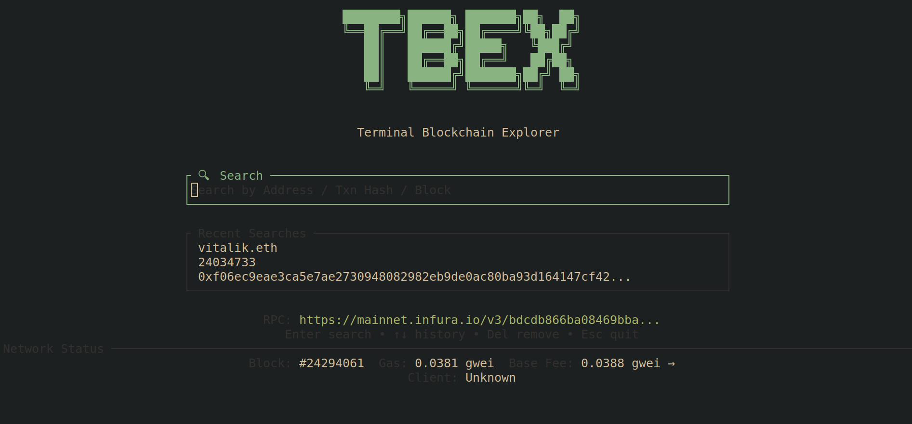
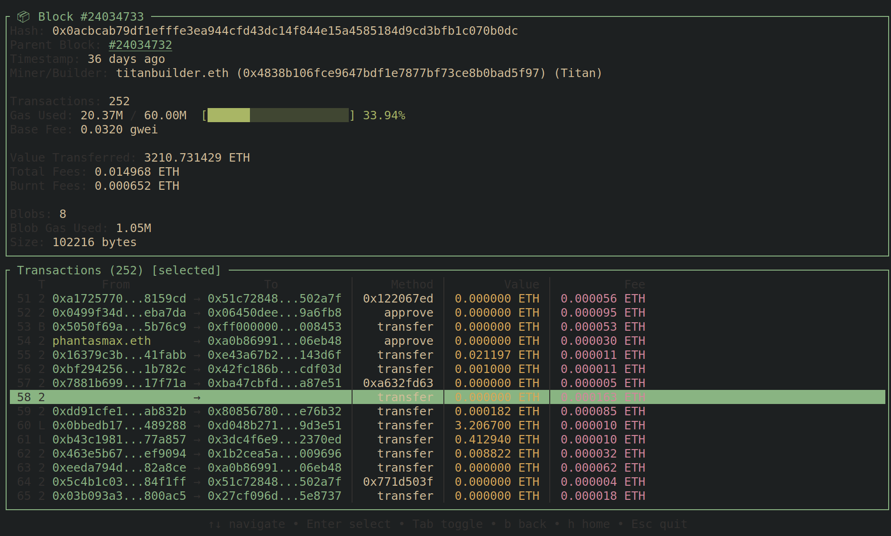
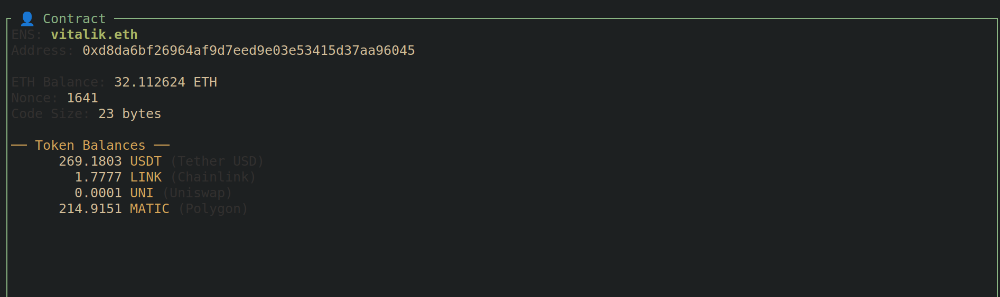

# tbex
Locally hosted terminal Ethereum block explorer.  All you need is an Ethereum rpc.

Tbex stores no data locally other than your rpc and most recent 10 searches.  Only the rpc knows what data you're querying.  This makes tbex very lightweight and only limited by your rpc speed.

# Disclaimers
Tbex only displays data made available by rpc calls.  

This does not include account histories: there is no rpc call to get all transactions related to a given address.  Web based block explorers are able to display account information because they ingest and re-index all chain data, creating a new link address -> transactions.  Tbex does however display balances of some top tokens, if an address has a balance.

For the above reasons, Tbex should be used as a BLOCK and TRANSACTION explorer instead of a "peep on my friends balance" explorer for the above reasons.  

Another restriction of relying purely on rpc calls is that most calldata can't be decoded.  Tbex attempts to decode common transactions and events so you'll see relevant information.

# Screenshots






# Config location
The config stores your current rpc and the most recent 10 searches you've made. 

Linux:     ~/.config/tbex/config.toml on Linux
Mac:       /Users/Alice/Library/Application Support/tbex/config.toml
Windows:   C:\Users\Alice\AppData\Roaming/tbex/config.toml

# Testing 

## Running Tests

```bash
# Run all tests (unit + integration)
cargo test

# Run only unit tests
cargo test --lib

# Run only UI integration tests
cargo test --test ui

# Run specific UI test file
cargo test --test ui home_tests
cargo test --test ui block_tests
cargo test --test ui tx_tests
cargo test --test ui address_tests
cargo test --test ui common_tests

# Run tests for a specific source module
cargo test rpc::tests
cargo test ui::tests
cargo test app::tests
cargo test search::tests
```

## Test Structure

```
tests/
├── ui.rs                   # Entry point for UI tests
└── ui/
    ├── mod.rs              # Shared imports, mock data, helper functions
    ├── home_tests.rs       # Home/RPC setup screen tests 
    ├── block_tests.rs      # Block page tests 
    ├── tx_tests.rs         # Transaction page tests 
    ├── address_tests.rs    # Address page tests 
    └── common_tests.rs     # Error, loading, layout, nav tests 

src/
├── app.rs                  # Unit tests for app state 
├── rpc.rs                  # Unit tests for RPC/formatting 
├── search.rs               # Unit tests for query parsing 
└── ui/
    ├── mod.rs
    ├── helper.rs           # Unit tests for UI helpers 
    ├── block_page.rs
    ├── tx_page.rs
    └── address_page.rs
```

All mock data helpers are in `tests/ui/mod.rs`:


